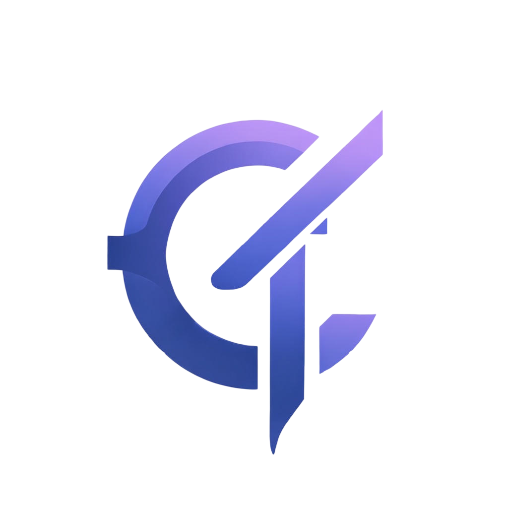
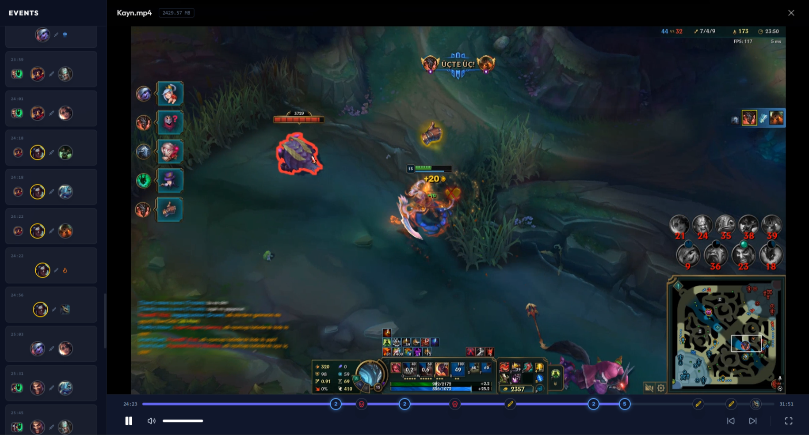
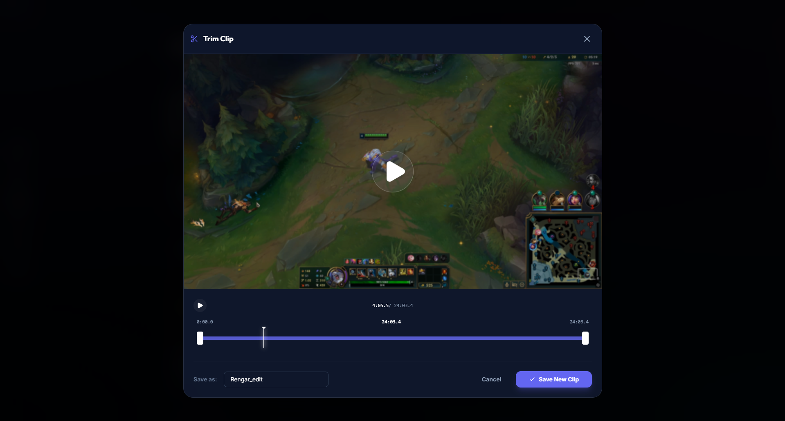
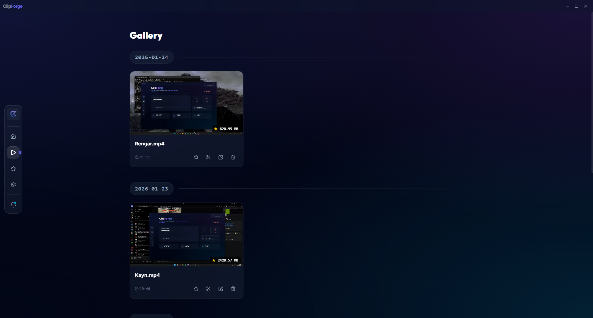

  
  <h1>ClipForge</h1>
  
<strong>Oyun anlarını kaçırmaman için hafif ve akıllı ekran kayıt aracı.</strong>

  
  

## 🚀 Nedir ve Neden ClipForge?

**ClipForge**, arka planda minimum kaynak tüketimiyle (~200-300 MB RAM) çalışarak oyun içi veya masaüstü aktivitelerinizi kesintisiz kaydeder. Bir 'clutch' anında belirlediğiniz klavye kısayoluna (hotkey) basarak, geriye dönük son 5-60 saniyeyi yüksek kalitede anında bilgisayarınıza kaydetmenizi sağlar.

*   **Sürekli Kayıt:** Medal.tv, ShadowPlay veya OBS Replay Buffer mantığıyla çalışır.
*   **Ultra Hafif:** Sistem performansınızı ve oyun FPS'nizi etkilemeyecek şekilde özel olarak tasarlanmıştır.
*   **Akıllı Sıkıştırma (H.265):** %70-90 oranında daha küçük video boyutları sunarak depolama alanından tasarruf sağlar.
*   **Gecikmesiz Kalite:** Sistem sesi ve mikrofon ayrı ayrı veya birleşik olarak yüksek kalitede, sıfıra yakın senkronizasyon kaymasıyla kaydedilir.
*   **Tamamen Yerel:** Tüm verileriniz tamamen güvenli bir şekilde kendi diskinizde kalır; buluta zorunlu veya gizli veri fırlatmaz.

## 🎯 Temel Özellikler

*   **Hızlı Klip (Instant Replay):** Ayarlanabilir uzunlukta geriye dönük anında video yakalama.
*   **Manuel Kayıt Yöneticisi:** Modern arayüz üzerinden esnek başlat/durdur fonksiyonu.
*   **Gelişmiş Klasör/Klip Yönetimi:** Dahili medya oynatıcısı ve kliplere yıldız (favori) ekleyebilme özelliği.
*   **Dinamik Çözünürlük Kontrolü:** Auto, 1080p, 720p, 480p ve kişiselleştirilmiş bitrate destekleri.
*   **Discord Tam Entegrasyon (Rich Presence):** Hesabınızı bağlayarak ne izlediğinizi veya anlık uygulamanızı Discord profilinize yansıtma.
*   **Premium Tasarım:** Pürüzsüz animasyonlarla hazırlanmış modern, koyu tema ve glassmorphism odaklı arayüz (Bento tasarımı).

## 💻 Geliştiriciler İçin (Tech Stack)

ClipForge, maksimum performans, düşük bellek kullanımı ve modern bir arayüz sunabilmek adına aşağıdaki güncel teknolojilerle derlenmiştir:
-   **Tauri v2 (Rust):** Çekirdek uygulama mimarisi, işletim sistemi bazlı kısayol dinleyiciler ve ultra hafif backend yönetimi.
-   **React 19 & Vite:** Oldukça hızlı çalışan, reaktif web tabanlı modern kullanıcı arayüzü motoru (frontend).
-   **Tailwind CSS v4 & Framer Motion:** Karmaşık CSS kodlarına ihtiyaç duymaksızın estetik glassmorphism UI stilleri ve mikro-animasyon çözümleri.
-   **TypeScript:** Statik tür güvenliği ile sıfır hatalı, bakımı kolay kod mimarisi.

## 📸 Ekran Görüntüleri

## 📥 Sistem Gereksinimleri ve İndirme

- Windows 10 ve Windows 11 platformlarında sorunsuz çalışır.
- Tüm tam ekran ve çerçevesiz oyunlar tarafından desteklenmektedir.

→ [Güncel ClipForge Sürümünü İndir (Release)](https://github.com/ZenoxyDev/ClipForge-Releases/releases/latest)

## 📞 Geri Bildirim ve Destek

Sorun yaşaman durumunda uygulamanın gelişimine katkıda bulunmak veya bir problem bildirmek istersen aşağıdaki kanallardan ulaşabilirsin:
-   **Email:** info@zenoxdev.shop
-   **Discord Topluluğu:** [Katılmak İçin Tıkla](https://discord.gg/75N6ACzjsH)

---

  ClipForge ile hiçbir anı kaçırmayın. 🔥 | Projeyi faydalı bulduysan repo'ya bir ⭐ bırakmayı unutma!

